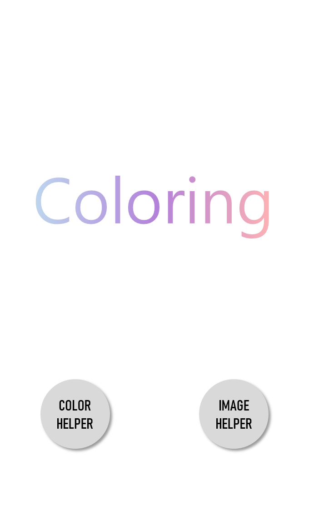
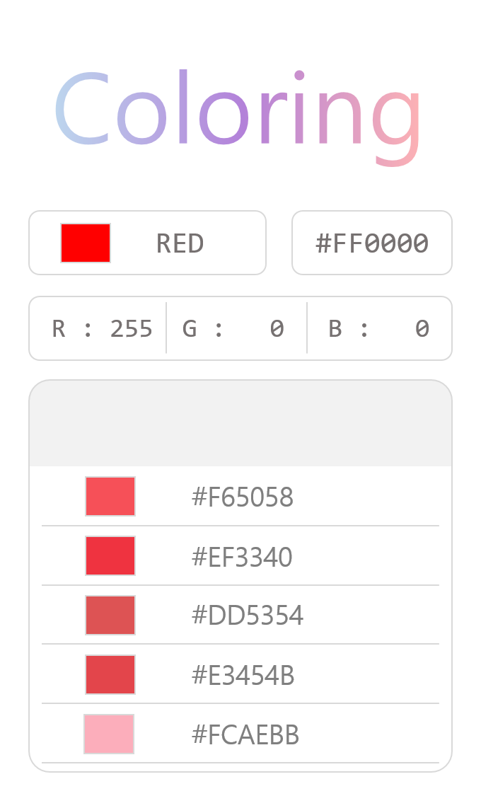
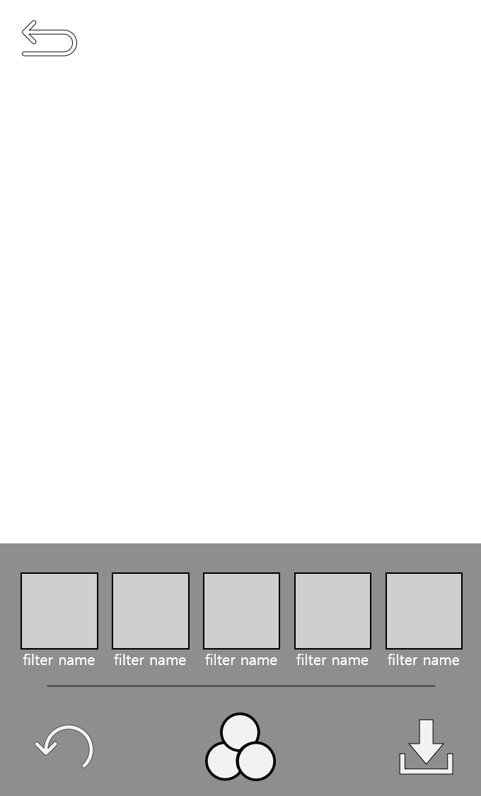

# Client

This codes are Server, Python.  
If you want to use this project.  
you will be download Android-Client code  
  
이 코드는 파이썬으로 만든 서버입니다.  
만약 프로젝트를 시연하고 싶다면 아래 링크의 안드로이드 클라이언트를 다운해 주세요.

Client Code : [Client](https://github.com/1000hg/Coloring_Client)

# Coloring_Server

Coloring is the use of artificial intelligence to filter color recommendations and photos.  
  
컬러링은 인공지능을 활용하여 색상을 추천해주고 사진을 필터링해주는 기능입니다. 

# how to use

```
#use socket
python server.py
#use bluetooth
python server_blue.py
```

# Warning

this repository do not have yolo weight, config and etc. if you want to use. please downolad files inside directory : yolo/
  
이 레퍼지토리는 욜로 가중치 등이 없습니다. 사용하기를 원하신다면 파일들을 다운로드하여 yolo/디렉토리 안에 넣어주시길 바랍니다.

# hard_fork

https://www.pyimagesearch.com/2018/09/03/semantic-segmentation-with-opencv-and-deep-learning/


# Testing

## Main Scene
  

## ColorHelper


## ImageHelper

